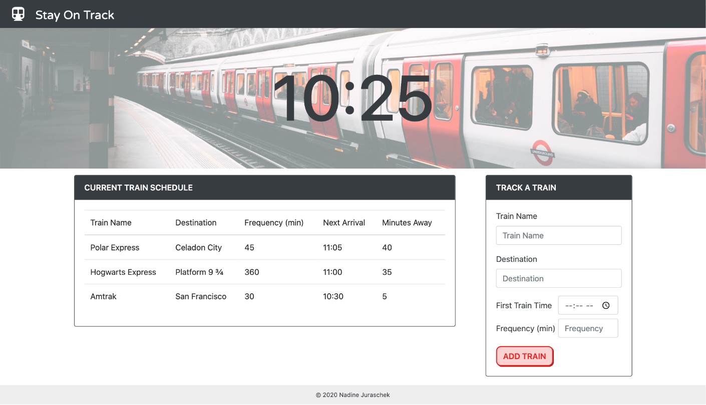

# Stay On Track
## Train Scheduler

Scheduling application that incorporates Google Firebase to host arrival and departure data of ficitonal trains. It makes use of Moment.js to retrieve and manipulate each saved train's departure and arrival information.

## Live Demo
Try it out [here](https://nadinejuraschek.github.io/Stay-On-Track/).

## Preview

## Technologies
* JavaScript
  * jQuery
* Bootstrap
* Moment.js
* Firebase Realtime Database
